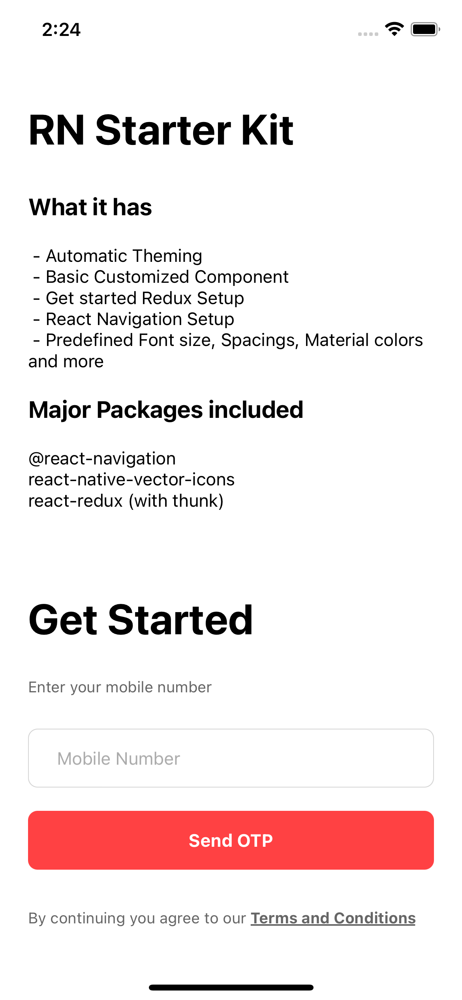
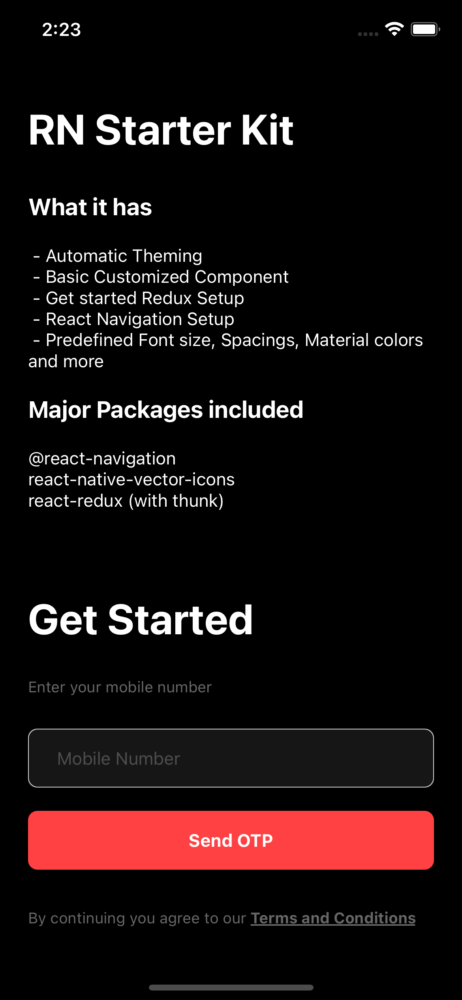

# rn-starter_pack
A React Native Ready to go code with Automatic Theming, Custom Components and Redux Setup andmore

 


## Steps to Setup your project with this starter code

1. Replace if the files already exists( Like App.js, index.js etc) and Copy all the files to your project
2. Import Icon Fonts 
    - Add the existing icon font in ```project_assets``` folder or add your own 
      - for Android copy and paste the icomoon.ttf to /android/app/src/main/assets/fonts 
      - for iOS create a folder as /ios/Fonts and add the icomoon.ttf file using xCode to ```Fonts``` folder 
3. Now you have to add packages required for this setup
   - In package.json
     under ```dependencies``` paste these
   
    `
    "@react-native-community/masked-view": "^0.1.11",
    "@react-navigation/devtools": "^5.1.22",
    "@react-navigation/native": "^5.9.4",
    "@react-navigation/stack": "^5.14.5",
    "prop-types": "^15.7.2",
    "react": "17.0.1",
    "react-native": "0.64.2",
    "react-native-gesture-handler": "^1.10.3",
    "react-native-reanimated": "^2.2.0",
    "react-native-safe-area-context": "^3.2.0",
    "react-native-screens": "^3.4.0",
    "react-native-vector-icons": "^8.1.0",
    "react-redux": "^7.2.4",
    "redux-thunk": "^2.3.0" 
    `
    
      under ```devDependencies``` paste these
    
     `   "@babel/core": "^7.12.9",
         "@babel/runtime": "^7.12.5",
         "@react-native-community/eslint-config": "^2.0.0",
         "babel-jest": "^26.6.3",
         "eslint": "7.14.0",
         "jest": "^26.6.3",
         "metro-react-native-babel-preset": "^0.64.0",
         "react-test-renderer": "17.0.1" `
         
## NOW YOU ARE GOOD TO GO
   ### The code is very simple It contains redux setup, dark & light theming, basic style constants and many more things
